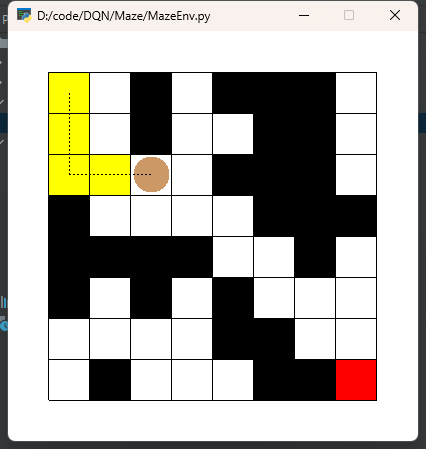
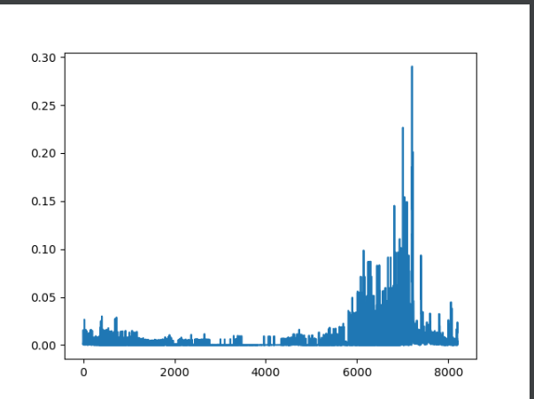

## DQN_base

DQN algorithm by Pytorch - some simple demo

## 简介

它是一个简单的迷宫类游戏，如下图这样

DQN训练过程的损失曲线，如下图这样

## 系统环境

+ windows + CUDA=11.6
+ miniconda3
+ python=[3.7.12](https://www.python.org/downloads/ 
  - conda create -n dqn python=3.7.12
+ pytorch=[1.7.1](https://pytorch.org/get-started/previous-versions/)  # numpy==1.21.6
  - conda install pytorch==1.7.1 cudatoolkit=11.0 -c pytorch
  - pip install "torch-1.7.1+cpu-cp37-cp37m-win_amd64.whl" # https://download.pytorch.org/whl/torch/
+ conda install gym[classic_control] # gym=0.21.0
+ conda install pygame==2.1.0 tensorboard=2.11.2 tensorboardX==2.5.1 pyglet==1.5.27

## 参考连接

+ https://blog.csdn.net/ningmengzhihe/article/details/130147972